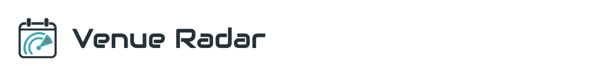

# [Open Venue Radar](https://gon-uri.github.io/venue-radar/)

**Venue Radar** is a scientific conference calendar for finding the next place
to share your research. It tracks conferences in machine learning and AI, data
science and time series, responsible AI, signal processing and vision,
biomedical AI, neuroscience, and complex systems and control.

Browse submission opportunities, conference dates and locations, rankings,
and historical acceptance rates. Uncertain dates are clearly marked as estimates.

Missing a conference? [Send a request](https://github.com/gon-uri/venue-radar/issues/new?template=conference-request.yml)
or join the comments on the website.

If Venue Radar is useful to you, please **star this repository** and
[follow @gonzauri on X](https://x.com/gonzauri).

Created and maintained by **Gonzalo Uribarri**, Assistant Professor at the
[Department of Computer and Systems Sciences](https://www.su.se/english/divisions/department-of-computer-and-systems-sciences),
Stockholm University.
[University profile](https://www.su.se/profiles/g/gour8957) ·
[Google Scholar](https://scholar.google.com/citations?user=q5sweuIAAAAJ&hl=en) ·
[GitHub](https://github.com/gon-uri)

Code is available under the [MIT license](LICENSE). Original written content
and original project artwork are available under [CC BY 4.0](CONTENT-LICENSE.md).
Both allow commercial reuse with the required attribution/notices. Third-party
material retains its own terms.
