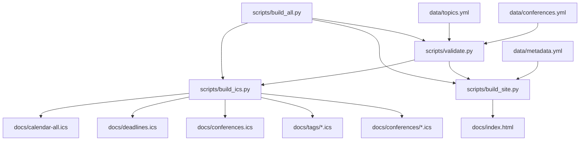

# Architecture

Last synchronized: 2026-07-08

## System Diagram



## Directory Structure

```text
data/
  conferences.yml                 canonical conference records
  metadata.yml                    site-level metadata such as last_updated
  topics.yml                      controlled topic vocabulary
  core_conferences_normalized_tags.xlsx
scripts/
  validate.py                     schema and consistency checks
  build_ics.py                    ICS feed generation
  build_site.py                   static HTML site generation
  build_all.py                    validate, then build all generated outputs
docs/
  index.html                      generated GitHub Pages site
  calendar-all.ics                generated aggregate calendar feed
  deadlines.ics                   generated deadline-only feed
  conferences.ics                 generated conference-date feed
  tags/*.ics                      generated topic feeds
  conferences/*.ics               generated per-conference feeds
project_docs/
  implementation_status.md        maintained project-state documentation
  roadmap.md                      maintained high-level roadmap
  architecture.md                 maintained architecture reference
  decisions.md                    maintained ADR log
  session_log.md                  maintained work-session history
AGENTS.md                         lightweight agent onboarding instructions
.github/workflows/
  build.yml                       CI validation and build workflow
```

## Main Modules

- `scripts/validate.py`: Loads YAML data, parses dates, validates required fields, controlled values, topics, source URLs, and deadline uniqueness.
- `scripts/build_ics.py`: Converts valid conference records into standards-oriented VCALENDAR output with deterministic UIDs, escaped text, folded lines, and stable ordering.
- `scripts/build_site.py`: Converts valid conference records and metadata into a standalone `docs/index.html` page with filters, tabs, countdowns, confidence labels, and download links.
- `scripts/build_all.py`: Runs validation once, then invokes both builders and prints generated paths.

## Responsibilities

- `data/conferences.yml` owns conference facts and confidence levels.
- `data/topics.yml` owns allowed topic labels.
- `data/metadata.yml` owns site-level publication metadata.
- `docs/*.ics` and `docs/index.html` are generated public artifacts.
- `project_docs/*.md` files are maintained source documentation and should not be treated as generated outputs.
- `AGENTS.md` is a lightweight agent entrypoint that points to `project_docs/` and avoids duplicating full architecture or status details.

## Data Flow

1. A maintainer edits `data/conferences.yml`, `data/topics.yml`, or `data/metadata.yml`.
2. `scripts/validate.py` verifies the conference records and controlled taxonomy.
3. `scripts/build_ics.py` writes aggregate, topic, and per-conference calendar feeds into `docs/`.
4. `scripts/build_site.py` writes the static website to `docs/index.html`.
5. GitHub Pages serves the committed `docs/` folder.
6. CI runs validation and full build on pushes and pull requests.
7. Maintainers update `project_docs/` after code, data, architecture, or workflow changes.

## APIs

- Command-line interfaces:
  - `python scripts/validate.py`
  - `python scripts/build_ics.py`
  - `python scripts/build_site.py`
  - `python scripts/build_all.py`
- Public static outputs:
  - `docs/index.html`
  - `docs/calendar-all.ics`
  - `docs/deadlines.ics`
  - `docs/conferences.ics`
  - `docs/tags/*.ics`
  - `docs/conferences/*.ics`
- Data interface:
  - YAML records in `data/conferences.yml` must include the required fields defined by `scripts/validate.py`.

## Important Classes

The project currently uses procedural Python functions and built-in data structures. There are no important classes.

## Important Interfaces

- Conference record schema: Required fields and allowed values are enforced in `scripts/validate.py`; durable project guidance lives in `project_docs/` and the lightweight agent entrypoint is `AGENTS.md`.
- Agent handoff interface: Future coding sessions should start with `AGENTS.md`, then read all files in `project_docs/` before making modifications.
- Topic taxonomy: Every topic in a conference record must match an entry in `data/topics.yml`.
- Calendar UID interface: UIDs derive from conference `id` plus event type, for example `neurips-2026-deadline-full-paper@scientific-conference-calendar`.
- Generated site interface: The HTML uses data attributes such as `data-filter-row`, `data-topics`, `data-size`, `data-difficulty`, and `data-deadline` for client-side filtering and countdown rendering.

## Design Rationale

- The project is intentionally static: no backend, no database, no paid hosting, and no OpenAI API dependency.
- YAML keeps conference maintenance reviewable in Git.
- Validation runs before generation so bad data does not silently publish.
- Deterministic UIDs and stable sorting keep calendar subscriptions reliable across rebuilds.
- Generated outputs live in `docs/` so GitHub Pages can serve the site and calendar feeds directly.
- Project-state Markdown files live in `project_docs/`, separate from generated public artifacts, so future agents can recover current state from the repository alone without making `docs/` ambiguous.
