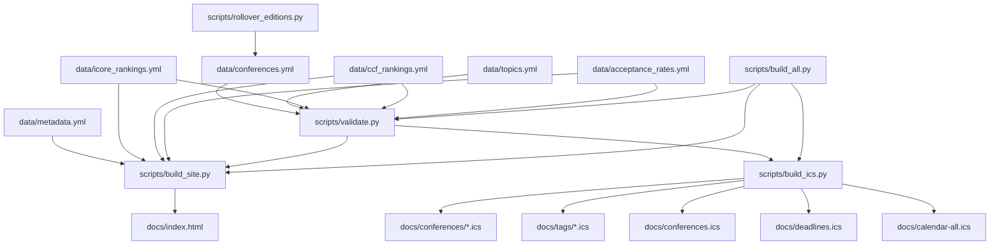

# Architecture

Last synchronized: 2026-10-07

## Repository Identity

The user renamed the repository to `gon-uri/venue-radar` on 2026-10-07.
The canonical website is https://gon-uri.github.io/venue-radar/; GitHub Pages
still publishes the main branch's /docs directory. Public navigation,
README attribution, and Giscus use the renamed repository. Giscus retains
repository ID R_kgDOTQKmZg, Announcements ID DIC_kwDOTQKmZs4DHLTi, and the
specific discussion term Venue Radar community.

Calendar downloads use relative paths beneath the new site URL. The historical
scientific-conference-calendar UID namespace remains deliberately unchanged:
repository branding is not event identity. Existing subscribers must replace
the old feed URL in their calendar client; GitHub does not redirect Pages URLs.

## Venue Radar Extension

The standalone generated HTML embeds the refined PNG logo, Leaflet JS/CSS,
Natural Earth land geometry, and local site assets. No map tiles, geocoder, or
organizer API is called at runtime. `data/cities.yml` maps exact canonical
location aliases to approximate city centers; only confirmed future meeting
dates with a mapped city are shown. Map markers and tables share filters.

The active 256px logo has four flat RGB colors: #263238 border, #38A6B0 radar
arcs/center/sweep, #C85C62 location dot, and #FFFFFF calendar interior. Its
original foreground alpha/geometry is preserved; the exterior stays transparent.
scripts/recolor_logo.mjs derives it from the immutable pre-recolor 256px source
under assets/branding. scripts/build_readme_banner.mjs renders a 1400x175 white
banner with the actual embedded Audiowide font and this logo. Both are optional
maintainer tools, not Python build or website runtime dependencies.

The header uses an 82px mark with a 42px title on desktop and a 66px mark with
a 34px title on mobile. Audiowide's native 400-weight Latin WOFF2 is embedded
in the HTML as a data URL; body/table typography is unchanged. The original
OFL notice is preserved in assets/vendor and the generated HTML. No external
font request is added to the public page. The native filter `details`/`summary`
retains its keyboard and expanded-state semantics; an aria-hidden 20px triangle
provides a consistently sized indicator, a 14px text gap, and open-state rotation.
Title offsets of 2px on desktop and 1.5px on mobile align visible logo and
letter bounds rather than just font line boxes. Narrow mobile titles wrap
between words instead of shrinking or overflowing; the logo stays centered
beside the complete text block. Four pixels of mobile brand padding contain
the font's taller text bounds without crowding the subtitle.

Search, topics, sizes, independent ICORE/CCF ranks, acceptance bands, and Clear
filters live in the native Filters & search `details` panel. Search is the
grid's last item, aligned beside Acceptance rate on desktop; mobile stacks it
below the metadata options. Topics & Subtopics families use native disclosure
markers, plus/minus signs, and hover hints. The panel starts collapsed at every
viewport and preserves its state when resized. The deadline-only Show only
submission opportunities checkbox sits outside, beside the tabs on desktop
and below them on mobile, remaining usable while the panel is collapsed.
Its label uses .94rem text and a fixed 19px native checkbox.
The Match selector and Clear filters share a flex footer, vertically centered
on the same row across desktop and mobile layouts.
Values within each rank group match with OR; separate groups
combine with AND. CCF's `source_url` and page numbers retain PDF evidence;
`page_url` points public rank links and the CCF Rank legend to the official
release webpage. ICORE Rank links to its conference portal.

`data/topic_families.yml` maps every controlled leaf to exactly one of seven
families. Edition records store up to four central leaves. Parent selection
expands to children; matching is OR within families, with selectable ANY/ALL
across families. Existing topic feed slugs remain stable.

Giscus is an optional, lazily loaded external client backed by public GitHub
Discussions, not a project backend. It requires a one-time owner app install.
GitHub request forms and discussion links work independently of Giscus.

New maintained modules and assets:
- `scripts/catalog_metadata.py`: family/city loading, validation, map payload.
- `scripts/export_catalog.py`: latest-series and vocabulary JSON export.
- `scripts/sync_workbook.mjs`: optional artifact-tool workbook synchronization;
  preserves table styles, validates values, renders previews, exports XLSX.
- `assets/site.css`, `assets/site.js`: embedded style and browser behavior.
- `assets/venue-radar.png`, `assets/venue-radar-original.png`: optimized and
  original selected artwork; the active optimized file is recolored, while the
  original generation and pre-recolor source remain unchanged. Banner and
  candidate provenance are kept under branding/.
- `assets/vendor/`: Leaflet, Natural Earth geometry, Lucide icons, Audiowide
  Latin WOFF2, and their original licenses.

The Python site/calendar build requires only requirements.txt. Workbook editing
and browser smoke tests use optional maintainer tooling, not runtime dependencies.
`project_docs/development.md` contains setup and verification commands.

Date-only official deadlines use `time_precision: date`: a known day does not
become a falsely exact hour. The site shows `(time est.)` beneath Time left only
when the selected next milestone has a confirmed day but an unknown cutoff
hour. The label updates with the next milestone; expanded dates retain an
explanatory tooltip without repeating the time-only comment. Estimated dates
still carry `(est.)` beside the milestone date. ICS exports an all-day deadline.
Stable UID keys are unchanged. Rollover now also supports explicitly configured
triennial series.

## System Diagram


```mermaid
flowchart TD
  A["data/conferences.yml"] --> V["scripts/validate.py"]
  B["data/topics.yml"] --> V
  C["data/metadata.yml"] --> S["scripts/build_site.py"]
  R["data/icore_rankings.yml"] --> V
  R --> S
  CR["data/ccf_rankings.yml"] --> V
  CR --> S
  AR["data/acceptance_rates.yml"] --> V
  AR --> S
  RO["scripts/rollover_editions.py"] --> A
  V --> I["scripts/build_ics.py"]
  V --> S
  I --> D1["docs/calendar-all.ics"]
  I --> D2["docs/deadlines.ics"]
  I --> D3["docs/conferences.ics"]
  I --> D4["docs/tags/*.ics"]
  I --> D5["docs/conferences/*.ics"]
  S --> H["docs/index.html"]
  BA["scripts/build_all.py"] --> V
  BA --> I
  BA --> S
```

## Directory Structure

```text
data/
  conferences.yml                 canonical conference records
  metadata.yml                    site-level metadata such as last_updated
  topics.yml                      controlled topic vocabulary
  icore_rankings.yml              sourced ICORE 2026 series ranks
  ccf_rankings.yml                sourced CCF 2026 series ranks
  acceptance_rates.yml            sourced historical acceptance rates
  core_conferences_normalized_tags.xlsx  synchronized catalog-reference workbook
scripts/
  validate.py                     schema and consistency checks
  build_ics.py                    ICS feed generation
  build_site.py                   static HTML site generation
  build_all.py                    validate, then build all generated outputs
  maintenance_report.py           source-linked edition and rate review queues
  rollover_editions.py             idempotent cadence-aware edition projections
docs/
  index.html                      generated GitHub Pages site
  calendar-all.ics                generated aggregate calendar feed
  deadlines.ics                   generated deadline-only feed
  conferences.ics                 generated conference-date feed
  tags/*.ics                      generated topic feeds
  conferences/*.ics               generated per-conference feeds
project_docs/
  implementation_status.md        maintained project-state documentation
  roadmap.md                      maintained high-level roadmap
  architecture.md                 maintained architecture reference
  decisions.md                    maintained ADR log
  session_log.md                  maintained work-session history
  data_maintenance.md             recurring data refresh procedure
AGENTS.md                         lightweight agent onboarding instructions
.github/workflows/
  build.yml                       CI validation and build workflow
```

## Main Modules

- `scripts/validate.py`: Loads YAML data, parses dates, validates required fields, controlled values, topics, source URLs, deadline gates, deadline uniqueness, rank mappings, and acceptance evidence.
- `scripts/build_ics.py`: Converts valid conference records into standards-oriented VCALENDAR output with deterministic UIDs, escaped text, folded lines, and stable ordering.
- `scripts/build_site.py`: Converts valid conference records, metadata, series ranks, and historical rates into a standalone `docs/index.html` page with filters, milestone-ordered deadlines, submission-opportunity status, a future/past conference split, source links, and downloads.
- `scripts/rollover_editions.py`: Adds missing next editions for explicitly configured recurring series, including annual, biennial, and triennial patterns, without replacing existing records; copied timing remains estimated until checked.
- `scripts/build_all.py`: Runs validation once, then invokes both builders and prints generated paths.

## Responsibilities

- `data/conferences.yml` owns conference facts and confidence levels.
- `data/topics.yml` owns allowed topic labels.
- `data/icore_rankings.yml` owns the optional ICORE 2026 series-level mapping and official portal provenance.
- `data/ccf_rankings.yml` owns direct CCF 2026 catalog matches, PDF-page provenance, and a separately validated official navigation webpage.
- `data/acceptance_rates.yml` owns historical rate evidence, edition, and track.
- `data/metadata.yml` owns site-level publication metadata.
- `docs/*.ics` and `docs/index.html` are generated public artifacts.
- `project_docs/*.md` files are maintained source documentation and should not be treated as generated outputs.
- `AGENTS.md` is a lightweight agent entrypoint that points to `project_docs/` and avoids duplicating full architecture or status details.

## Data Flow

1. About monthly, a maintainer reviews the two queues from `scripts/maintenance_report.py`, checks official sources against estimates, and edits the appropriate YAML source file. `scripts/rollover_editions.py` previews missing recurring editions.
2. `scripts/validate.py` verifies the conference records and controlled taxonomy.
3. `scripts/build_ics.py` writes aggregate, topic, and per-conference calendar feeds into `docs/`.
4. `scripts/build_site.py` writes the static website to `docs/index.html`.
5. GitHub Pages serves the committed `docs/` folder.
6. CI runs validation and full build on pushes and pull requests.
7. Maintainers update `project_docs/` after code, data, architecture, or workflow changes.

## APIs

- Command-line interfaces:
  - `python scripts/validate.py`
  - `python scripts/build_ics.py`
  - `python scripts/build_site.py`
  - `python scripts/build_all.py`
  - `python scripts/maintenance_report.py --max-age-days 30`
  - `python scripts/rollover_editions.py --as-of YYYY-MM-DD` (preview; add `--write` after review)
- Public static outputs:
  - `docs/index.html`
  - `docs/calendar-all.ics`
  - `docs/deadlines.ics`
  - `docs/conferences.ics`
  - `docs/tags/*.ics`
  - `docs/conferences/*.ics`
- Data interface:
  - YAML records in `data/conferences.yml` must include the required fields defined by `scripts/validate.py`.

## Important Classes

The project currently uses procedural Python functions and built-in data structures. There are no important classes.

## Important Interfaces

- Conference record schema: Required fields and allowed values are enforced in `scripts/validate.py`; `gate_for` links a prerequisite to its paper deadline. Meeting `confidence` is distinct from optional deadline `confidence`. `opens_at` and `open_observed_on` are evidence that a route is open now. Ranks and rates join by exact series name. Rates retain their historical year, track, and source. Durable project guidance lives in `project_docs/` and the lightweight agent entrypoint is `AGENTS.md`.
- Agent handoff interface: Future coding sessions should start with `AGENTS.md`, then read all files in `project_docs/` before making modifications.
- Topic taxonomy: Every topic in a conference record must match an entry in `data/topics.yml`.
- Calendar UID interface: UIDs derive from conference `id` plus event type, for example `neurips-2026-deadline-full-paper@scientific-conference-calendar`.
- Generated site interface: The HTML uses data attributes such as `data-filter-row`, `data-topics`, `data-size`, `data-icore`, `data-ccf`, `data-acceptance`, and serialized deadline details for client-side filtering and status evaluation. Missing ranks match the corresponding Unranked option; workshops do not inherit scores. The next chronological milestone includes conference start. An opportunities filter retains open, upcoming, and estimated submission routes, excluding closed ones. Future conferences are sorted by start date; ongoing/past editions appear separately. Estimated dates never become confirmed-open solely from a future timestamp.

## Design Rationale

- The project is intentionally static: no backend, no database, no paid hosting, and no OpenAI API dependency.
- YAML keeps conference maintenance reviewable in Git.
- Validation runs before generation so bad data does not silently publish.
- Deterministic UIDs and stable sorting keep calendar subscriptions reliable across rebuilds.
- Generated outputs live in `docs/` so GitHub Pages can serve the site and calendar feeds directly.
- Project-state Markdown files live in `project_docs/`, separate from generated public artifacts, so future agents can recover current state from the repository alone without making `docs/` ambiguous.
