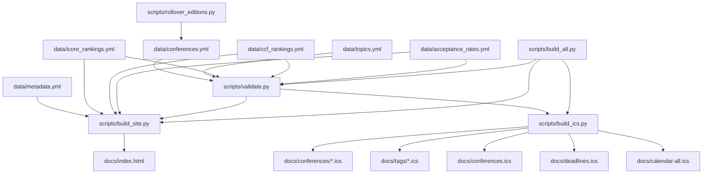

# Architecture

Last synchronized: 2026-10-06

## System Diagram


```mermaid
flowchart TD
  A["data/conferences.yml"] --> V["scripts/validate.py"]
  B["data/topics.yml"] --> V
  C["data/metadata.yml"] --> S["scripts/build_site.py"]
  R["data/icore_rankings.yml"] --> V
  R --> S
  CR["data/ccf_rankings.yml"] --> V
  CR --> S
  AR["data/acceptance_rates.yml"] --> V
  AR --> S
  RO["scripts/rollover_editions.py"] --> A
  V --> I["scripts/build_ics.py"]
  V --> S
  I --> D1["docs/calendar-all.ics"]
  I --> D2["docs/deadlines.ics"]
  I --> D3["docs/conferences.ics"]
  I --> D4["docs/tags/*.ics"]
  I --> D5["docs/conferences/*.ics"]
  S --> H["docs/index.html"]
  BA["scripts/build_all.py"] --> V
  BA --> I
  BA --> S
```

## Directory Structure

```text
data/
  conferences.yml                 canonical conference records
  metadata.yml                    site-level metadata such as last_updated
  topics.yml                      controlled topic vocabulary
  icore_rankings.yml              sourced ICORE 2026 series ranks
  ccf_rankings.yml                sourced CCF 2026 series ranks
  acceptance_rates.yml            sourced historical acceptance rates
  core_conferences_normalized_tags.xlsx  synchronized catalog-reference workbook
scripts/
  validate.py                     schema and consistency checks
  build_ics.py                    ICS feed generation
  build_site.py                   static HTML site generation
  build_all.py                    validate, then build all generated outputs
  maintenance_report.py           source-linked edition and rate review queues
  rollover_editions.py             idempotent annual/biennial edition projections
docs/
  index.html                      generated GitHub Pages site
  calendar-all.ics                generated aggregate calendar feed
  deadlines.ics                   generated deadline-only feed
  conferences.ics                 generated conference-date feed
  tags/*.ics                      generated topic feeds
  conferences/*.ics               generated per-conference feeds
project_docs/
  implementation_status.md        maintained project-state documentation
  roadmap.md                      maintained high-level roadmap
  architecture.md                 maintained architecture reference
  decisions.md                    maintained ADR log
  session_log.md                  maintained work-session history
  data_maintenance.md             recurring data refresh procedure
AGENTS.md                         lightweight agent onboarding instructions
.github/workflows/
  build.yml                       CI validation and build workflow
```

## Main Modules

- `scripts/validate.py`: Loads YAML data, parses dates, validates required fields, controlled values, topics, source URLs, deadline gates, deadline uniqueness, rank mappings, and acceptance evidence.
- `scripts/build_ics.py`: Converts valid conference records into standards-oriented VCALENDAR output with deterministic UIDs, escaped text, folded lines, and stable ordering.
- `scripts/build_site.py`: Converts valid conference records, metadata, series ranks, and historical rates into a standalone `docs/index.html` page with filters, milestone-ordered deadlines, submission-opportunity status, a future/past conference split, source links, and downloads.
- `scripts/rollover_editions.py`: Adds missing next editions for a curated set of annual/biennial series without replacing existing records; all copied timing remains estimated until checked against organizer sources.
- `scripts/build_all.py`: Runs validation once, then invokes both builders and prints generated paths.

## Responsibilities

- `data/conferences.yml` owns conference facts and confidence levels.
- `data/topics.yml` owns allowed topic labels.
- `data/icore_rankings.yml` owns the optional ICORE 2026 series-level mapping and official portal provenance.
- `data/ccf_rankings.yml` owns direct CCF 2026 catalog matches and PDF-page provenance.
- `data/acceptance_rates.yml` owns historical rate evidence, edition, and track.
- `data/metadata.yml` owns site-level publication metadata.
- `docs/*.ics` and `docs/index.html` are generated public artifacts.
- `project_docs/*.md` files are maintained source documentation and should not be treated as generated outputs.
- `AGENTS.md` is a lightweight agent entrypoint that points to `project_docs/` and avoids duplicating full architecture or status details.

## Data Flow

1. About monthly, a maintainer reviews the two queues from `scripts/maintenance_report.py`, checks official sources against estimates, and edits the appropriate YAML source file. `scripts/rollover_editions.py` previews missing recurring editions.
2. `scripts/validate.py` verifies the conference records and controlled taxonomy.
3. `scripts/build_ics.py` writes aggregate, topic, and per-conference calendar feeds into `docs/`.
4. `scripts/build_site.py` writes the static website to `docs/index.html`.
5. GitHub Pages serves the committed `docs/` folder.
6. CI runs validation and full build on pushes and pull requests.
7. Maintainers update `project_docs/` after code, data, architecture, or workflow changes.

## APIs

- Command-line interfaces:
  - `python scripts/validate.py`
  - `python scripts/build_ics.py`
  - `python scripts/build_site.py`
  - `python scripts/build_all.py`
  - `python scripts/maintenance_report.py --max-age-days 30`
  - `python scripts/rollover_editions.py --as-of YYYY-MM-DD` (preview; add `--write` after review)
- Public static outputs:
  - `docs/index.html`
  - `docs/calendar-all.ics`
  - `docs/deadlines.ics`
  - `docs/conferences.ics`
  - `docs/tags/*.ics`
  - `docs/conferences/*.ics`
- Data interface:
  - YAML records in `data/conferences.yml` must include the required fields defined by `scripts/validate.py`.

## Important Classes

The project currently uses procedural Python functions and built-in data structures. There are no important classes.

## Important Interfaces

- Conference record schema: Required fields and allowed values are enforced in `scripts/validate.py`; `gate_for` links a prerequisite to its paper deadline. Meeting `confidence` is distinct from optional deadline `confidence`. `opens_at` and `open_observed_on` are evidence that a route is open now. Ranks and rates join by exact series name. Rates retain their historical year, track, and source. Durable project guidance lives in `project_docs/` and the lightweight agent entrypoint is `AGENTS.md`.
- Agent handoff interface: Future coding sessions should start with `AGENTS.md`, then read all files in `project_docs/` before making modifications.
- Topic taxonomy: Every topic in a conference record must match an entry in `data/topics.yml`.
- Calendar UID interface: UIDs derive from conference `id` plus event type, for example `neurips-2026-deadline-full-paper@scientific-conference-calendar`.
- Generated site interface: The HTML uses data attributes such as `data-filter-row`, `data-topics`, `data-size`, `data-icore`, `data-acceptance`, and serialized deadline details for client-side filtering and status evaluation. The next chronological milestone includes conference start. An opportunities filter retains open, upcoming, and estimated submission routes, excluding closed ones. Future conferences are sorted by start date; ongoing/past editions appear separately. Estimated dates never become confirmed-open solely from a future timestamp.

## Design Rationale

- The project is intentionally static: no backend, no database, no paid hosting, and no OpenAI API dependency.
- YAML keeps conference maintenance reviewable in Git.
- Validation runs before generation so bad data does not silently publish.
- Deterministic UIDs and stable sorting keep calendar subscriptions reliable across rebuilds.
- Generated outputs live in `docs/` so GitHub Pages can serve the site and calendar feeds directly.
- Project-state Markdown files live in `project_docs/`, separate from generated public artifacts, so future agents can recover current state from the repository alone without making `docs/` ambiguous.
