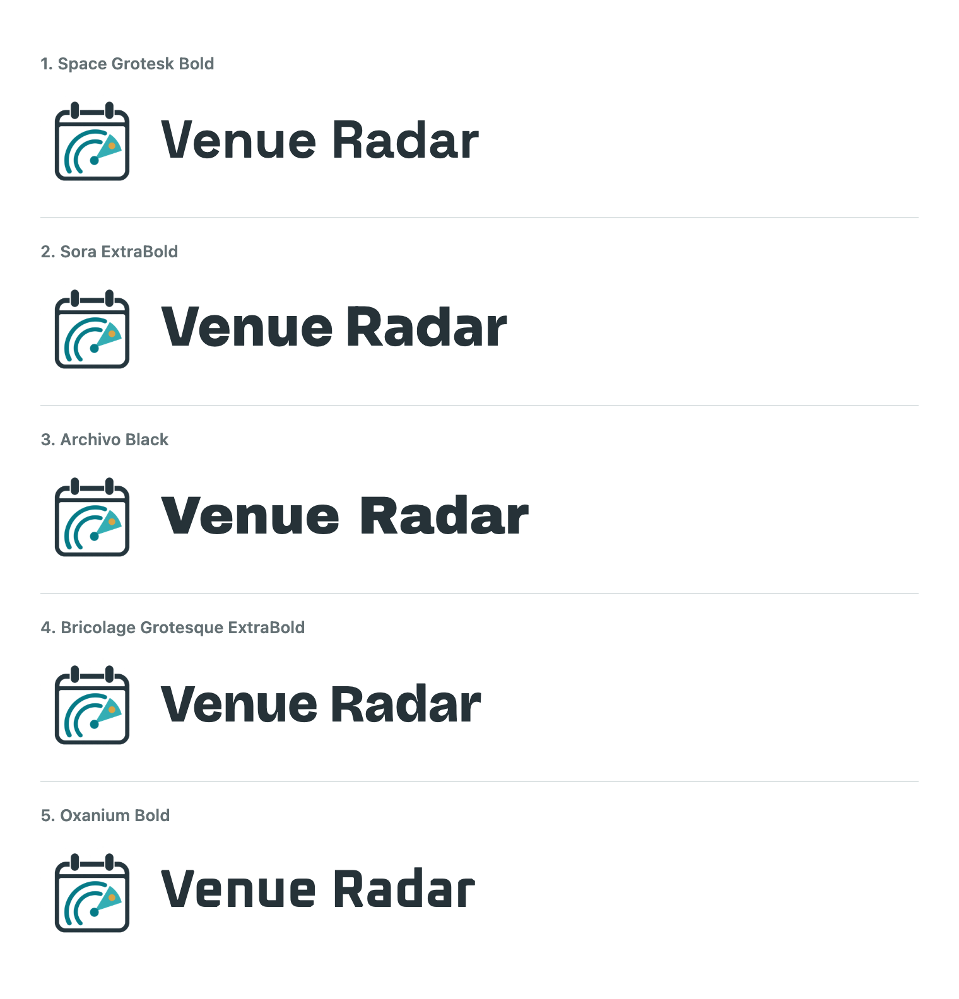
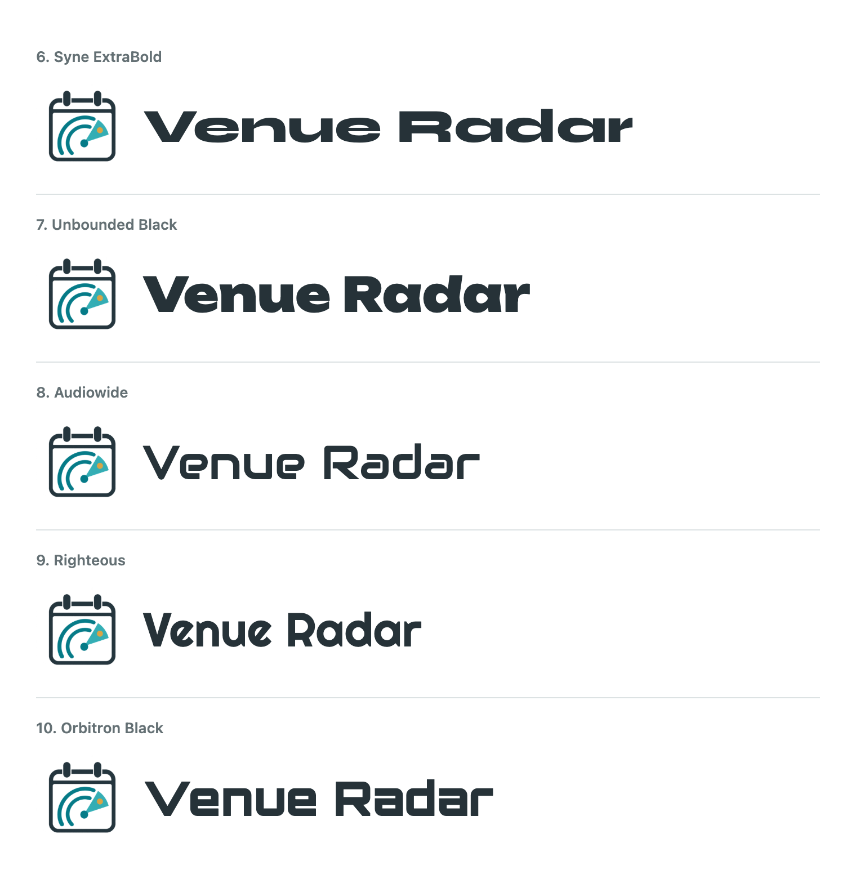

# Venue Radar Title Typography

Prepared: 2026-10-07
Status: Audiowide (option 8) selected by the user for the public title.

## Approved Sizing Changes

- Desktop title: 36px to 42px (+16.7%); logo: 76px to 82px (+7.9%).
- Mobile title: 29.6px to 34px (+14.9%); logo: 62px to 66px (+6.5%).
- Filters & search: 20px heading and triangle indicator, with an explicit 14px
  arrow/text gap, roughly twice the former native-marker spacing.
- The native details/summary disclosure retains keyboard operation and its
  accessible expanded state. The decorative triangle is aria-hidden and rotates
  when the panel opens. Topic-family disclosure controls are unchanged.

## First Five Font Options

The preview uses actual font files from the official Google Fonts repository,
not an AI approximation or substituted system font. Every option uses the same
42px title, 82px logo, neutral #263238 color, and zero letter spacing.

| Option | Font | Weight | Design Direction |
| --- | --- | --- | --- |
| 1 | [Space Grotesk](https://github.com/google/fonts/tree/main/ofl/spacegrotesk) | Bold 700 | Clean, geometric, restrained |
| 2 | [Sora](https://github.com/google/fonts/tree/main/ofl/sora) | ExtraBold 800 | Confident, modern, highly legible |
| 3 | [Archivo Black](https://github.com/google/fonts/tree/main/ofl/archivoblack) | Native Black face, CSS 400 | Heavy, graphic presence |
| 4 | [Bricolage Grotesque](https://github.com/google/fonts/tree/main/ofl/bricolagegrotesque) | ExtraBold 800 | Characterful, slightly editorial |
| 5 | [Oxanium](https://github.com/google/fonts/tree/main/ofl/oxanium) | Bold 700 | Angular, overtly technical |

Recommended: Sora ExtraBold for a stronger title with clear letterforms;
Bricolage Grotesque ExtraBold is the more distinctive alternative. These are
design judgments recorded during the first proposal round.

## Five More Distinctive Options

The user requested more unusual display faces and better logo/text vertical
alignment. Options 6-10 keep the same 42px title, 82px logo, color, and zero
letter spacing. Actual fonts are loaded before rendering; native single-weight
display faces are not given synthetic bold styling.

| Option | Font | Weight | Design Direction |
| --- | --- | --- | --- |
| 6 | [Syne](https://github.com/google/fonts/tree/main/ofl/syne) | ExtraBold 800 | Extremely wide, graphic lettering |
| 7 | [Unbounded](https://github.com/google/fonts/tree/main/ofl/unbounded) | Black 900 | Bold geometric display with distinctive shapes |
| 8 | [Audiowide](https://github.com/google/fonts/tree/main/ofl/audiowide) | Native display face, CSS 400 | Rounded technological forms |
| 9 | [Righteous](https://github.com/google/fonts/tree/main/ofl/righteous) | Native display face, CSS 400 | Rounded, retro-inspired personality |
| 10 | [Orbitron](https://github.com/google/fonts/tree/main/ofl/orbitron) | Black 900 | Angular science-fiction display |

Recommended in this round: Unbounded Black for distinctive but legible branding.
Syne ExtraBold is the most overtly graphic alternative. These are design
preferences from the second proposal round; the user subsequently chose Audiowide.

### Vertical Alignment

The second-round renderer measures the visible, non-background pixel bounds
of each logo and text sample, rather than relying on CSS line-box centering.
It then applies a font-specific vertical offset to the text. Measured offsets
at 42px were +2.22px (Syne), +1.01px (Unbounded), +1.73px (Audiowide), +1.25px
(Righteous), and +1.49px (Orbitron), with less than 0.1px geometric centre error.
The five finished previews were visually inspected. These offsets belong to
the specimens; final public-header alignment must be checked at both title
sizes after the user selects a face. No production alignment/font code changed
in this second-round proposal.

## Selected Implementation

Audiowide applies only to the title; the existing body/table font is unchanged.
The native display face uses CSS weight 400 with synthetic styles disabled.
The 13,744-byte Latin WOFF2 in assets/vendor/audiowide-latin.woff2 is embedded
by scripts/build_site.py with a system fallback and font-display: swap.
No Google Fonts request is made at runtime. The original SIL OFL 1.1 notice
is preserved in assets/vendor/Audiowide-OFL.txt and the generated HTML;
THIRD_PARTY_NOTICES.md records attribution. The font is not original artwork
covered by Venue Radar's content license.

The approved 42px/34px title and 82px/66px logo sizes remain. Optical offsets
of 2px on desktop and 1.5px on mobile center the visible mark and lettering,
including narrow-mobile two-line titles. Four pixels of mobile brand padding
contain the taller font bounds while preserving the subtitle's separation.
Browser checks verify the loaded embedded font, unchanged body/table fonts,
and fit across all six responsive test widths.

Preview font binaries and scratch renderers are in
`/private/tmp/venue-radar-typography/`, not in public site assets. Both sets of
five faces were checked as successfully loaded before their PNGs were captured.
The PNGs are design-review artifacts, not part of docs/index.html. Only the
selected Audiowide font is included in public runtime assets.
